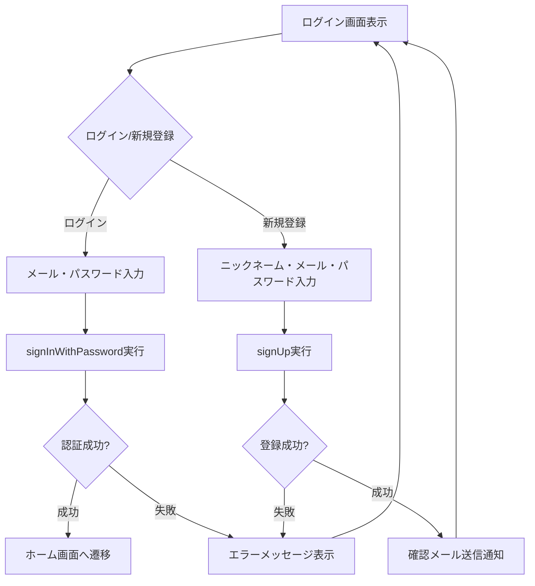
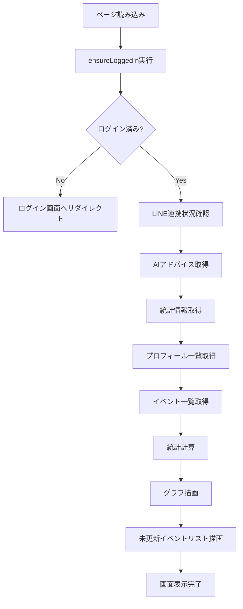
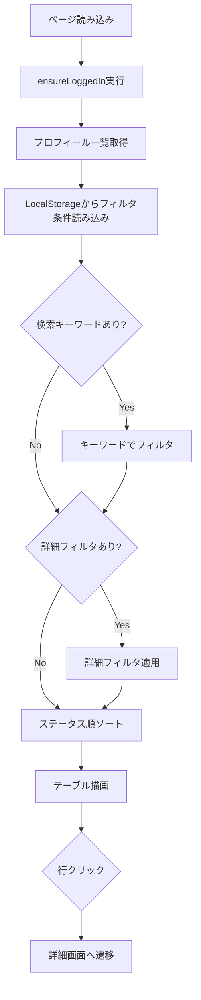
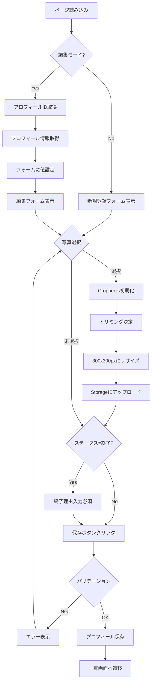
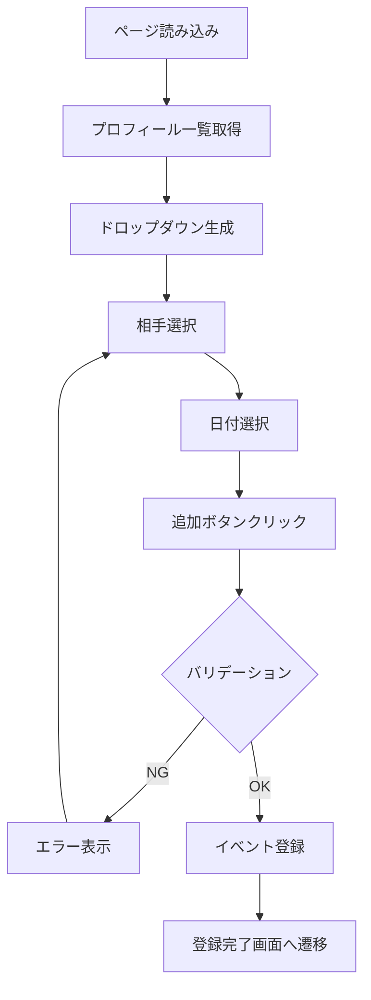
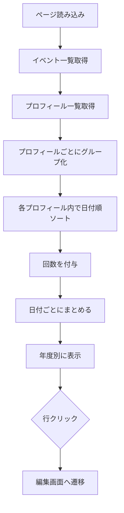
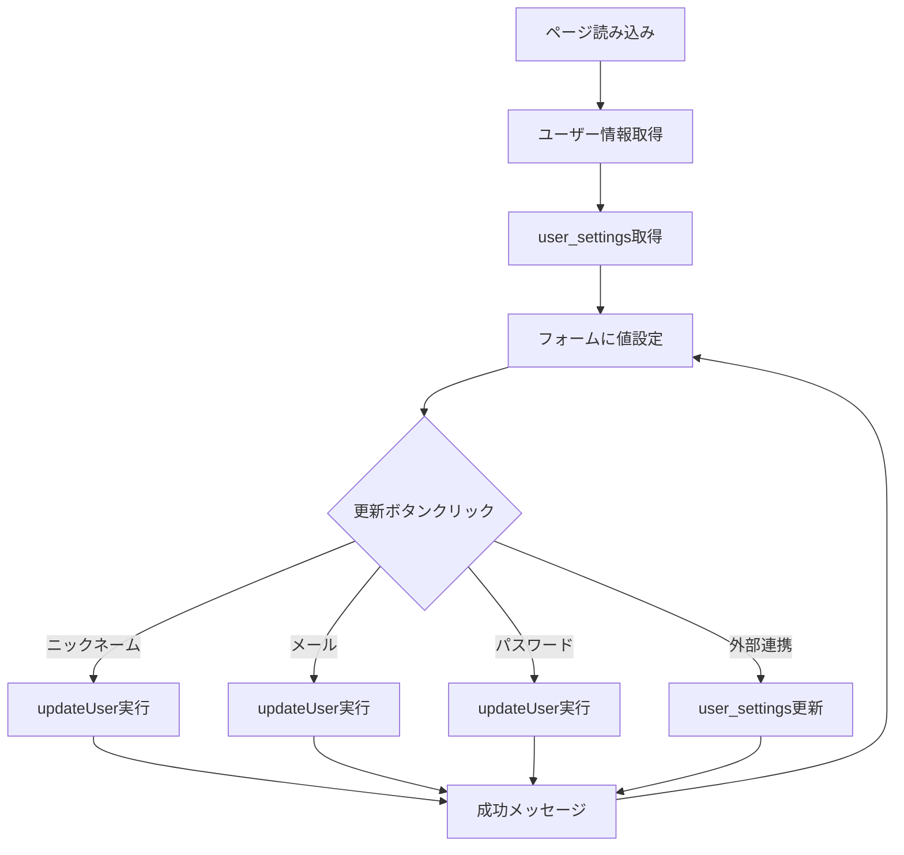
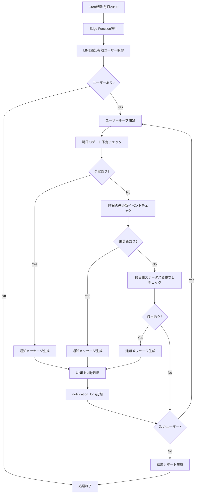
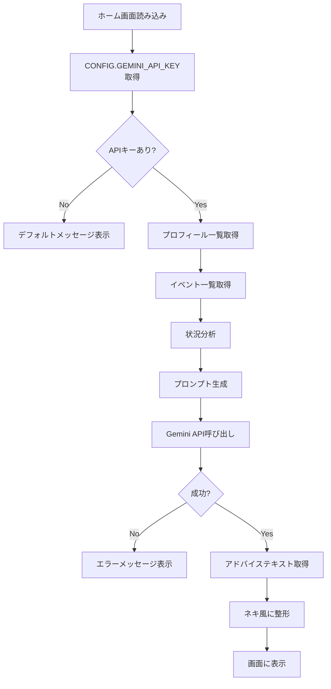
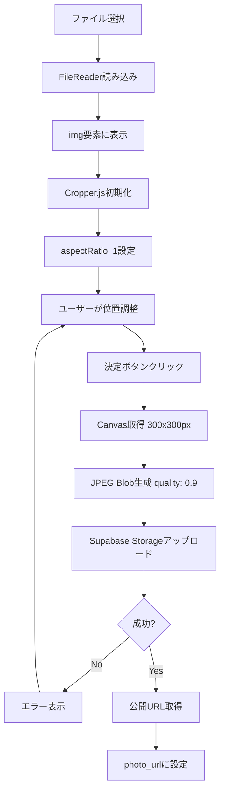

# 処理フロー図

## 1. ログインフロー

## 2. ホーム画面読み込みフロー

## 3. プロフィール一覧表示フロー

## 4. プロフィール登録/編集フロー

## 5. デート登録フロー

## 6. カレンダー表示フロー

## 7. アカウント更新フロー

## 8. 通知送信フロー

## 9. AIアドバイス生成フロー

## 10. 写真トリミングフロー

